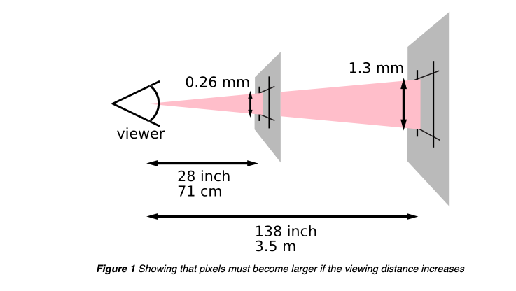

# 前言

基于CSS的Media Query是解决Web响应式(Responsive)的常见方法。

它的格式非常简单，例如如下的代码，就表示当屏幕的像素不大于600px时，括号里的CSS样式生效

```scss
  @media only screen and (max-width: 600px) {
    font-size: 14px;
  }
```

除了支持基于screen的响应式，也支持一些其他的媒体类型，例如基于打印的：

```scss
 @media only print and (max-width: 600px) {
    font-size: 14px;
  }
```

甚至一些更复杂feature：

```scss
@media (prefers-color-scheme: dark) {
  .day.dark-scheme   { background:  #333; color: white; }
  .night.dark-scheme { background: black; color:  #ddd; }
}

@media (orientation: landscape) {
  body {
    flex-direction: row;
  }
}

@media (min-resolution: 72dpi) {
  p {
    text-decoration: underline;
  }
}
```

你可以打开这里查看更多： [Using media queries - CSS: Cascading Style Sheets | MDN (mozilla.org)](https://developer.mozilla.org/en-US/docs/Web/CSS/Media_Queries/Using_media_queries#media_features)


# 问题

当我们使用基于屏幕或者打印纸的响应式设计时，往往需要跟像素打交道。

对于下面的代码，

```scss
 @media only screen and (max-width: 600px) {
    font-size: 14px;
  }
```

它会在IPhone X中生效，因为通过ChromeDevTools我们可以看到Iphone X的屏幕宽度是375px，低于我们在这里设置的600px。

但是如果你足够细心，会发现这并不是IphoneX的真实屏幕分辨率，它的分辨率高达1125*2436 pixels


为什么会存在这样的gap？真实的分辨率与media query中的分辨率又是如何换算的？


# 解释

## 为什么需要换算？

因为基于实际分辨率来执行media query是有bug的。

例如5.8寸的IPhone X的分辨率是1125\*2436 pixel，而我正在使用的这台27寸显示器的分辨率是2560\*1440 pixel，这两个设备分辨率相似，但是尺寸差了n倍，使用同一套响应式设计显然说不通。

IphoneX显然应该使用与它尺寸类似的Iphone 6相同的响应式设计，而后者的分辨率只有750\*1334。


所以，浏览器在处理media query时，都会使用一套换算机制，这套机制似乎是基于屏幕的尺寸大小而不是分辨率来计算的，比如Iphone 6与Iphone X的宽度都被当作了375px。


## 如何换算？

我从很早就知道media query中的px并不等同于设备的实际分辨率，但是对于如何换算却一直没有深入研究。

研究了Web标准( [CSS Values and Units Module Level 3 (w3.org)](https://www.w3.org/TR/css-values-3/#absolute-lengths))，才发现答案原来是如此简单，然而我之前的理解是错误的。


关于“如何换算”这个问题的答案，是`根本没有换算`。

在标准中，px作为一种距离单位，被划入了"Absolute Length Unit"，也就是说，它跟cm, inch, mm这一类的单位一样，都是可以被物理测量的。正因为如此，这些单位之间存在固定的换算关系（例如1cm=10mm），也因此被叫做“绝对长度单位”。

在标准中，px的定义是`1/96th of 1in`,  也就是`一英寸（2.54厘米）的1/96`。也就是说，在Web领域，一个屏幕的宽度是多少px，跟屏幕分辨率或者像素密度完全没有关系，只跟屏幕的尺寸相关。


一切似乎到此为止了，我本着认真负责的精神，基于IPhone X 375\*812的尺寸，计算了下它的对角线长度

```javascript
export function playground() {
  const screenSize = 5.8; // 5.8英寸，屏幕的物理尺寸（对角线长度）
  const width = 375; // 宽度
  const height = 812; // 高度
  const diagonal = Math.sqrt(
    Math.pow(width / 96, 2) + Math.pow(height / 96, 2)
  );
  console.log(screenSize, diagonal); //  5.8 9.316769388595908
}
```

发现得到的结果完全不对，怎么算出来的对角线长度成了9.32inch，与标称的5.8英寸屏幕相差甚远。
如果长宽各除以一个1.6, 结果与预期差不多

```javascript
export function playground() {
  const screenSize = 5.8; // 5.8英寸，屏幕的物理尺寸（对角线长度）
  const width = 375 / 1.6; // 宽度
  const height = 812 / 1.6; // 高度
  const diagonal = Math.sqrt(
    Math.pow(width / 96, 2) + Math.pow(height / 96, 2)
  );
  console.log(screenSize, diagonal); //  5.8 5.822980867872443
}
```


于是进一步的学习了标准。

绝对距离单位，例如cm, inch, mm, 虽然可以被物理测量，且存在相互间换算关系，但是在屏幕，纸张（打印）等不同介质中，含义是不同的。举个例子，屏幕的1cm跟纸张的1cm，基本上不是一个东西。

理解这个，需要再了解几个概念

### 几个概念

#### Anchor

在浏览器创建CSSDOM过程中，需要计算computted value（比如将width: 100%处理成实际的长度，或者处理优先级以确定apply到一个元素上的最终css property）。

在计算computed value的过程中，会围绕着某一种距离单位进行

对于纸张等介质，anchor会围绕着物理单位进行，比如会把所有的数值都换算成inch。

但对于屏幕介质，anchor会围绕着reference pixel进行，即将px换算成reference pixel。


#### Reference pixel

Reference pixel是一个角度单位。
Reference pixel/Viewport pixel/CSS pixel是同一个东西。
1px = 1/96 inch，这也是对的，但是这里的inch也是CSS的inch，并不一定代表`物理的1/96 inch`。

> The reference pixel is *the visual angle* of one pixel on a device with a pixel density of 96dpi and a distance from the reader of an arm’s length. 

这个官方的定义听起来有一些拗口，总结一下就是reference pixel是一个角度，它是一个常量。

设备的距离不同，reference pixel代表的大小也就不同:



## 最终的答案

* px是一个`角度`单位
* 每一个屏幕媒介的视距不同，角度不同，因此视角也不同
* 视角决定屏幕的px/reference pixel是多少


总结一下，为什么pixel是一个角度，而不是物理长度，这是因为角度更能反应`一个物体对于观者有多大`这一个事实（透视原理）。
27寸显示器与6寸手机屏幕的观看距离是类似的，但显示器更大，这也就是为什么显示器的宽度pixel值更大。
使用pixel，我就不需要关心一个元素在不同的屏幕上显示的物理尺寸问题了。将一段文字设置为16px的font-size，那这些文字在观者看来，在所有不同屏幕媒介上的观者大小应该是差不多的。

# 总结


* 最后总结一下，px其实是一个角度尺寸。
* px与屏幕的像素不是一个概念。
* px的定义跟介质类型有关。
* inch也不一定代表物理上的一英寸

* 一个屏幕离使用者的距离越远，px代表的物理尺寸越大
* 多数情况设计者不需要考虑px代表的物理大小，而只需要考虑他的“可视角度大小”。

