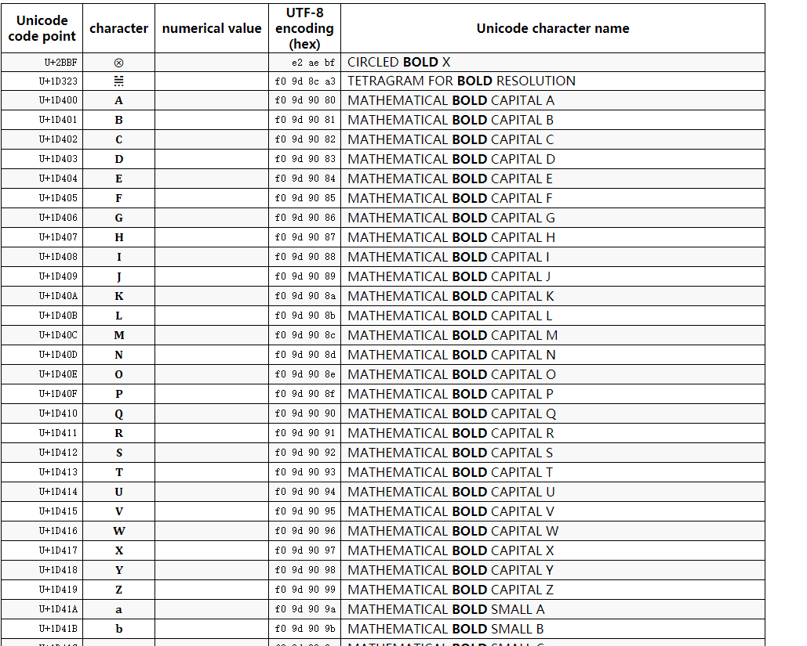

## 问题
项目中使用了lodash进行一段字符串的处理：
```javascript
_.lowerCase('𝐇𝐄𝐋𝐋𝐎');
```
我们期待它将字符串转换为小写的`hello`，但实际上lodash返回了这样的结果：
```javascript
"𝐇 𝐄 𝐋 𝐋 𝐎"
```
使用原生的`String.toLowerCase`则没有任何效果
```javascript
'𝐇𝐄𝐋𝐋𝐎'.toLowerCase()
// "𝐇𝐄𝐋𝐋𝐎"
```
## 问题的原因

我们注意到出现问题的字符串`𝐇𝐄𝐋𝐋𝐎`是一种粗体的形式，而这不是因为存在任何的样式，而是因为，它们是一些特殊的字符，就像`你我他`这样的汉字一样。

我们在[这个网站](https://unicode-search.net/unicode-namesearch.pl?term=BOLD)上发现了更多的关于这些特殊字符的信息




**它们是一些特殊的字符**，从lodash的源码我们也可以看到，`_.lowerCase`方法对’非常规‘的字符做了一些特殊的处理，将其替换为空格（在后面我们会解释’非常规‘是什么意思）:

```javascript
/**
 * Converts `string`, as space separated words, to lower case.
 *
 * @since 4.0.0
 * @category String
 * @param {string} [string=''] The string to convert.
 * @returns {string} Returns the lower cased string.
 * @see camelCase, kebabCase, snakeCase, startCase, upperCase, upperFirst
 * @example
 *
 * lowerCase('--Foo-Bar--')
 * // => 'foo bar'
 *
 * lowerCase('fooBar')
 * // => 'foo bar'
 *
 * lowerCase('__FOO_BAR__')
 * // => 'foo bar'
 */
const lowerCase = (string) => (
  words(toString(string).replace(reQuotes, '')).reduce((result, word, index) => (
    result + (index ? ' ' : '') + word.toLowerCase()
  ), '')
)
```

## Unicode

在上面提到的网站中，我们看到了一些名词，unicode, unicode code point, character, UTF-8 encoding等，它们都代表什么意思呢？

### 什么是Unicode

> Unicode is a standard character set that numbers and defines [characters](https://developer.mozilla.org/en-US/docs/Glossary/Character) from the world's different languages, writing systems, and symbols. By assigning each character a number, programmers can create [character encodings](https://developer.mozilla.org/en-US/docs/Glossary/Character_encoding), to let computers store, process, and transmit any combination of languages in the same file or program. 
>
>  --- MDN, https://developer.mozilla.org/en-US/docs/Glossary/Unicode

unicode是一个标准，它定义了一个非常大的字符集，包含了这个世界上各种不同的语言文字和符号，包括中文、英文、数字、标点，甚至还包含emoji，在最新的unicode标准中，它定义了超过14万个不同的字符。

**简单来说，unicode标准试图给世界上存在的每一种符号，赋予一个独特的编码。**

例如，`U+4F60`被用来表示`你`, `U+1D407`则被用来表示上面问题中提到的`𝐇`

### 码点(code point)

刚刚提到的，用来表示`你`的`U+4F60`和用来表示`H`的`U+1D407`，被称作码点(code point)。

在unicode字符集中的每一个符号，都有一个唯一的码点。

码点是一串数字，在最新的标准中，码点可以用一个长度为六的十六进制数表示，取值范围从`#000000`一直到`#10FFFF`，因此理论上讲它可以容纳`17*(2^16)=1114112`个字符

#### 平面

在用于表示码点的六位十六进制数中，前两位被称作平面，用于对unicode字符进行分区。

最常见的0号平面被称作Basic Multilingual Plane(基本多语种平面)，对应的码点区间是U+000000 ~ U+00FFFF，包含了最常见的一些字符。

从#00到#FF，技术上讲，我们可以支持多达256个平面，但目前最新的Unicode 13.0版中，只定义了17个平面，并且有部分平面并没有分配任何字符。

### 编码

我们刚才提到，unicode标准为每一种字符都指定了唯一的code point，因此，一段文字也可以理解成一大堆code point数据。但是在计算机系统中，我们还需要找到一些高效的方式来将这些code pint数据转换为二进制，以进行存储和传输，这些方式被称作编码。而UTF-8， UTF-16都是常见的编码方式。

#### UTF-32

每一个字符对应的码点可以由6位的16进制数组成，也就是24bit。因此，我们可以使用简单粗暴的方式，用4个字节（32bit）来表示每一个字符，这种编码方式被称为UTF-32

例如：对于code point为`U+1D407`的字符`𝐇`，用UTF-32表达就是： `0x0000 0000 0000 0001 1101 0100 0000 0111`

我们注意到UTF-32编码的输出中有大量冗余的0，而实际上最常用的字符通常都在U+0000~U+FFFF这个区间里，因此，UTF-32会有比较大的空间浪费。


## 参考阅读

